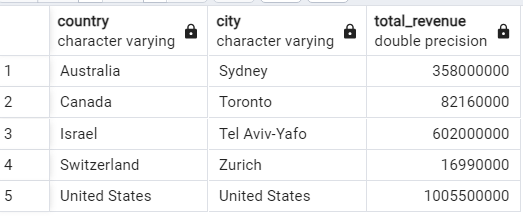

Answer the following questions and provide the SQL queries used to find the answer.

    
**Question 1: Which cities and countries have the highest level of transaction revenues on the site?**


SQL Queries:
```SQL
-- Generating the cities from each country with highest level of transaction revenues
select country, city, total_revenue
from (   -- Creating subquery with totaltransaction revenue by each city within the country
        select country,city,
               max(totaltransactionrevenue) as total_revenue,
	             RANK() OVER (PARTITION BY country ORDER BY max(totaltransactionrevenue) DESC) as rank
        from all_sessions
	      where totaltransactionrevenue is not null
        group by country, city
	 ) as sub
where rank = 1
```     


Answer:




**Question 2: What is the average number of products ordered from visitors in each city and country?**


SQL Queries:
```SQL 
--The average number of products ordered from visitors in each city and country
select country, city ,
        avg(productquantity) as avg_product_ordered
from all_sessions
group by country, city 
having avg(productquantity) <> 0
order by country, city
```


Answer:


**Question 3: Is there any pattern in the types (product categories) of products ordered from visitors in each city and country?**


SQL Queries:

```SQL  

create temp table overall_cate as
(    -- Product categories of products ordered from visitors in each city and country
   select  country, city, p.name as productname, v2productcategory,
           sum(orderedquantity) as total_products
	  
   from all_sessions s
   join products p on s.productsku = p.sku
   group by country,city,p.name, v2productcategory
   having sum(orderedquantity) <> 0
   order by country, city, total_products desc
)
```
// Finding pattern in the query
```SQL
( -- finding top 3 orders with highest volume ordered in each city and country 
        select country, city, v2productcategory, max(total_products) as order,
                'Most Popular' as type 
       from overall_cate
group by country, city, v2productcategory
order by max(total_products) desc
limit 3
)

union all -- Unioning columns from both the results that shows top 3 most and least popular orders placed by volume in each city and country

	
( -- finding top 3 orders with lowest volume ordered in each city and country 
        select  country, city, v2productcategory, 
                min(total_products) as order,
               'Least Popular' as type
        from overall_cate
group by country, city, v2productcategory
order by min(total_products) desc
limit 3
)
```


Answer:
## Product categories of products ordered from visitors in each city and country


## finding top 3 orders with highest volume ordered in each city and country 


## finding top 3 orders with lowest volume ordered in each city and country 


## Unioning columns from both the results that shows top 3 most and least popular orders placed by volume in each city and country


**Question 4: What is the top-selling product from each city/country? Can we find any pattern worthy of noting in the products sold?**


SQL Queries:
```SQL
 with sale_by_country as     -- Creating CTE with total products sold in each city from each country with products name
(
        select country, city, p.name as productname,
               sum(orderedquantity) as total_products, 
	       rank() over(partition by country,city order by sum(orderedquantity) desc) as rank -- Ranking the grouped products sold in each country and city 
from all_sessions s
join products p on s.productsku = p.sku
group by country,city,p.name
order by country, city
) 
-- selecting highest selling productnames from each city within each country 
select country, city, productname
from sale_by_country
where rank = 1 
```

Answer:


**Question 5: Can we summarize the impact of revenue generated from each city/country?**

SQL Queries:
```SQL
select country, city,
       sum(totaltransactionrevenue) as revenue
from all_sessions 
group by country, city
having sum(totaltransactionrevenue) <> 0
```

Answer:


